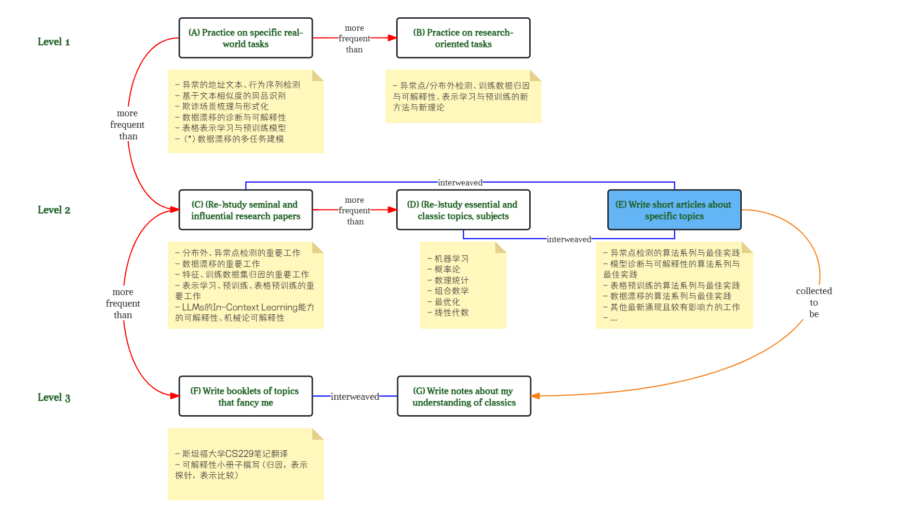
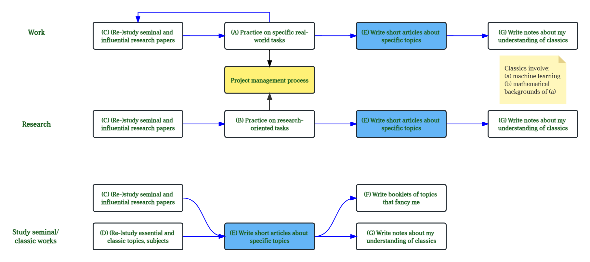

*作者：李冠林* | *感悟*

- toc
{:toc}
---

**（更新于2023.1.1，22:17）**一位好友提早看了上面的“温故”篇，他送了我一句由村上村树让其变得知名的佛语“pain is inevitable but suffering is optional”。我想我的好友是想要告诉我，在有限的时间内“get the things done”是一种“pain”，但这世上的成长总是伴随着“pain”的，然而，我却可以选择乐观而非感受“pain”所带来的“suffering”。

---

### 1. 温故2022

2022，祖国大地发生了许多事，光怪陆离，酸甜悲欢。置身事外的我，总是少了些思想觉悟。书读的少，各路新闻也不多见，眼界狭窄，也就变得中庸与后知后觉。所以要感谢这个和平的年代和生养我的父母，才能让“迷糊”的我不至于品尝悲苦。然而，回首看看自己的一亩三分地，也因为我的慵懒而变得贫瘠且缺乏生气。再瞅瞅身边认识的朋友，有持续求学、不断突破自己作出有影响力学术工作的，有去高校任教延拓科学与技术疆界的，有去躬耕初等教育、培养新一代青年学生的，还有去创业公司尝试撬动社会生活固有运转模式的，我羡慕且佩服她（他）们找到了自己下一阶段甚至是一辈子值得追求的事业，并且以不同的方式在为身边的人，甚至这个世界能变得更好而践行着。

#### 1.1. 定岗

2022上半年，我完成了学生生涯的第二篇学位论文，从哈尔滨工业大学博士研究生毕业，从学术界来到工业界，来到京东；2022年下半年，在轮岗近6个月后，逐渐感受到了新平台带给我的纷繁复杂却丰富多彩的问题场景，从京东科技的风控模型部、京东工业的数据与智能组、京东零售的广告投放组轮岗下来，还是打算定岗风控模型部。该选择的原因主要是：

- **未来课题不仅仅涉及自然语言处理**：风控体系所支撑的金融业务展现了精妙的复杂度，人与机器协同服务于产品与客户的场景比比皆是，在非平稳的（Non-stationary）环境中，如何融合各类型的数据源与方法用于提升数据驱动的决策智能的**可信赖性**（Trustworthiness）是十分有挑战的。
- **部门对可解释性算法工具化的重视**：上述可信赖性涉及决策过程的可解释性与透明性——i) 如何将前沿可解释性方法应用在模型开发过程中，辅助开发人员全面、事前地诊断模型行为；ii) 如何将透明模型与归因方法应用在模型与决策者的交互过程中，让决策更高效、更可靠。
- **部门对一定程度的技术探索所给予的自由度**：i) 在应用学术界新算法时，存在不确定性与适配性问题；ii) 在将具体业务场景中问题进行抽象后，存在对抽象结构进行形式化推演与理论化的问题，上述二者均需要深入的研究与探索。

上述原因的陈述算是中肯的，由于我希望未来的工作是充满挑战的、在一定自由度下不断学习、思考、探索、沉淀的过程，我的选择或许能较大程度地达我所愿吧。

#### 1.2. 糟糕的计划

2022年六月起，在毕业与入职的间隙，我重新开始“正儿八经”地用[notion](https://www.notion.so/)记录阅读、研究、协作计划，然而，直到昨天为止，这些计划却几乎“全军覆没”，我想分析一下失败的原因。首先，这些计划按照相似条目进行粗略聚类，可大致罗列如下：

- **经典教科书知识的学习**：数学分析（1），测度论（1）， 组合数学（2），启发式算法（0），理论统计学（1），须产出[notion相关知识页](https://epsilon-lee.notion.site/epsilon-s-Knowledge-Vault-8ed3afb9e8be43c4be98f01532c6b35e)。
- **研究型课题的执行**：基于神经网络表示的$$k$$-近邻透明模型（1），无监督任务型对话的实用方法研究（2），神经机器翻译中数据增强方法的系统性研究（0），须产出三篇论文。
- **机器学习专题博客撰写**：典型相关性分析（1），基于[LIME](https://arxiv.org/abs/1602.04938)与[SHAP](https://arxiv.org/abs/1705.07874)的可解释性方法（0），句子表示（1），须产出三篇博文。
- **专题调研报告的撰写**：机器学习的实用分析方法（0），斯坦福大学CS229课程笔记翻译（2），须产出两本小册子。

上述计划条目背后括号中的得分为其完成情况的大致评估，评分范围为0-10，0分代表“未开始”或“刚开始”，10代表“已完成”。

仔细想想，完成情况如此糟糕的原因有：

- **目标庞大不具体**：一方面，对于**“经典教科书知识的学习”**，许多参考书目不乏大部头，定计划时没有明确学习内容和学习目标，导致学习过程逐渐盲目，失去动力；另一方面，对于**“研究型课题的执行”**也是眼高手低，没有评估好个人能力和课题难度，让相对长周期且需要较大个人提升后才能做好的课题逐渐荒废。
- **对自己个性认知不足**：我的个性是追求第一原则与追根溯源，所以在进行**“机器学习专题博客撰写”**时，很难安下心来、“就事论事”地学习并掌握局部知识，然而，一旦追根溯源起来，查起资料来哪里是个尽头，本来碎片化的时间便无法负担起知识习得所需的时间开销，这也使得我对目标的制定总是过分乐观。
- **恒心与韧性的缺乏**：**“机器学习专题博客撰写”**与**“专题调研报告撰写”**相较**“研究型课题的执行”**的劳动成本是更低的，因为不需要花时间探索全新的问题与方法，也不需要工程开发与实验验证，而它们的完成效果却依然很差，归根结底都是我没有恒心与韧性的问题所在，被其他短期带来快感的事物吸引了注意力，导致用在计划之事上的时间资源稀缺。

所以，仔细想来，对于我来说：首先，从性格上看，做事不能急功近利，不能追求短频快，需要做长期的、打动我的事才能更加有恒心与韧性；其次，要逐渐建立起对“某某”方向或主题的追根溯源能力，逐渐将知识或问题的根源与历史认知体系健全起来，但在碎片化时间的利用上，也要习惯知识的解耦与层次性，更快速且独立地习得新知识；最后，目标的可达成性与达成时间开销要经过仔细的评估，而非来自一时头脑发热或一腔热血。

### 2. 盼望2023

#### 2.1. 元计划

2023，希望做事能更有条理，上图中呈现了一种条理，一种所谓的“meta plan”，并且还在“便签”区域罗列了部分具体的内容项。该图中的(A)-(G)是我所思考的“元计划”，即2023具体计划的指导原则。它们分为三个层次，Level 1 --> Leval 2 --> Level 3，每个层级由大写字母编号的“事”，以及连接“事”与“事”的带有语义的边所构成：

- 从层级1到层级3，做“事”的频率逐步降低：希望我在具体问题中的实践所占据的时间是最多的，不管是工作中遇到的偏落地的业务问题亦或是偏探索的研究问题，都需要有具体实施方案，且具备可执行、可度量、多阶段的特点。
- 同一层级的“事”往往可交替进行（interweaved），使它们频率相当，不至于一直做同一件事以维持新鲜感；高频的“事”的知识（“Read seminal works, essential topics”）或实践经验（“Practice specific real-world and research tasks”）的输入可转换为相对低频的输出(“Write short articles about specific topics”)，并进一步转换为更低频且带有更多个人思考的输出（“Write booklets”）。

基于上述“meta plan”，可以有如下图所示的几条“事”链，其标准作业流程（Standard Operating Procedure）也被形象地展示出来了：

- **以落地为目标的工作**：以推动业务发展，产品优化为目标，从业务/产品链路中拆解出来的关乎自动化、算法提效降本的关键节点。
- **具有探索性的研究**：从落地项目中抽离出更深刻的学术问题的探究。
- **经典著作与原创性工作的研究**：对机器学习及其基础知识的**（生成式）**重温，以及对有影响力工作的重新审视与解读。

无论**落地类**还是探索类的“事”，都存在立项、执行、验收等过程，可以严格遵循[**项目管理**](https://en.wikipedia.org/wiki/Project_management)的原则与逻辑。管理也是一门科学，管理学的知识也有必要在未来进行补充。

#### 2.2. 核心主题

我想，结合23年定岗后可能的工作状况、个人的兴趣爱好，与关于个人“知识”成长的目标，可以具体讲讲今年的几个较为明确的核心主题，以及现阶段我所认知的它们的关键问题。

- **分布外（Out-of-Distribution）、异常点（Anomaly）、离群点（Outlier）检测**
  - 关键问题：i) 文本异常点检测中，各类方法（基于概率密度的模型、基于分类器的模型）是如何适配各类任务的（机器翻译、问答、对话、情感分类、语法检测、可读性判别）？ ii) 异常点检测的可学习性理论？**[1]**
- **数据漂移（Dataset Shift）的检测、理解与适应**
  - 关键问题：i) 数据漂移从特征与标签维度如何可解释地被描述？**[2]** ii) 各数据漂移场景的漂移检测的可学习理论应该如何表述？

- **特征归因（Feature Attribution）、训练数据归因（Dataset Attribution）与透明模型（Transparent Model）**
  - 关键问题：i) 局部可解释性的可学习理论应该如何表述？**[3]** ii) 训练数据归因的可学习理论应该如何表述？iii) $$k$$-近邻样例标签集与标签全集上的预测机制的区别与联系是什么？从机制上是否具有更优的可解释性？...

以上三个主题中的“分布外检测”与“数据漂移”有着较强的落地场景和应用需求，需视时间成本从实用主义角度进行实践，“可解释性”则更偏探索一些，可以更多关注范式、算法与理论的创新。

#### 2.3. 人性的实践

2023年对我来说也意味着特别的一年，30而立，用周国平先生在《人生因孤独而丰盛》中的话来说便是：

> *“孔子说：‘三十而立’。我对此话的理解是：一个人在进入中年的时候，应该确立起生活的基本信念了。所谓生活信念，第一是做人原则，第二是做事的方向。也就是说，应该知道自己在这个世界上要做怎样的人，想做怎样的事了。”*

他接着说：

> *“当然，‘三十’不是硬指标。但是，‘立’与‘不立’是硬道理，无人能够回避。一个人有力‘立’，才真正成了自己人生的主人。”*

本博文的上文主要从回顾过去，与计划未来着眼，讲到了作为一个拥有专业“知识”的人，应如何自我成长的问题。但作为儿子与社会公民，未来作为丈夫、父亲的角色，应该遵从何种原则，如何履行责任、创造个人价值呢？关乎这些问题的部分答案，我在去年9月的博文[“开始记录更多”](https://epsilon-lee.github.io/blog/Starting-a-new-journey/)中有过“宏大”的设想，当时探讨的**长期目标**便是思考这些问题的一个维度。其中关于“知识传播”与“教育改革”的想法或许是最打动我的主题，因为它们关乎年轻人，而我越发觉得年轻人才是未来的希望，人类的美好梦想需要一代一代去接力。

除了上述利他价值的实现外，对于我的父母——最最亲爱的身边人——我也希望首要能践行所谓的“孝”吧。一个人若都不在意小家，而去在意大家的话，我想对我来说，是难以接受的。当然，可能受年代的局限，身体发肤受之父母，我认为在当下，只有首要爱父母才能推而广之到利他主义、到为社会贡献个人价值。但**如何**爱父母却是一个需要花时间思考问题，我的思考大致可简要列举如下：

1. **自爱即爱父母**：对于我的父母而言，他们将我的健康快乐作为他们快乐的源泉，只有我生活的好，健康快乐，他们便是最开心的，不然他们可能整天忧心忡忡，觉也睡不好。
2. **帮助父母成长**：随着时代的发展，新名词、新事物、新生活方式层出不穷，如何帮助父母逐步接纳、适应并参与进来，也是我的责任之一；只有当他们积极跟上时代的脚步时，才会感受到新时代带给他们的物质与精神生活的改变，他们才能更容易地从新生活中体会快乐。
3. **丰富物质与精神生活**：希望能从规划远途旅游开始，新的体验能带给人更多的快乐。
4. **关注健康**：一方面是日常的健康生活习惯的保持，这一点上我的爸妈做得强于我十倍；另一方面是定期体检。

### 3. 尾声

花了快两天时间，差不多把我认为一定要写的内容粗略的写过一遍，作为2023年开始的音符，希望能时常回过头来看看最开始都写了什么，也希望未来的写作所传达出来的内容能更加“consistent”，不管是延续还是颠覆都要有其逻辑和历史溯源性。

### 参考文献

**[1].** [Is Out-of-Distribution Detection Learnable](https://arxiv.org/abs/2210.14707), NeurIPS 2022.

**[2].** [paper-jam/Detection of distribution shift](https://github.com/Epsilon-Lee/paper-jam/blob/main/topics/ood-related-topics-and-generalization-mystery.md#detection-of-distribution-shift).

**[3]**. [Impossibility Theorems for Feature Attribution](https://arxiv.org/pdf/2212.11870.pdf), Dec. 2022.

