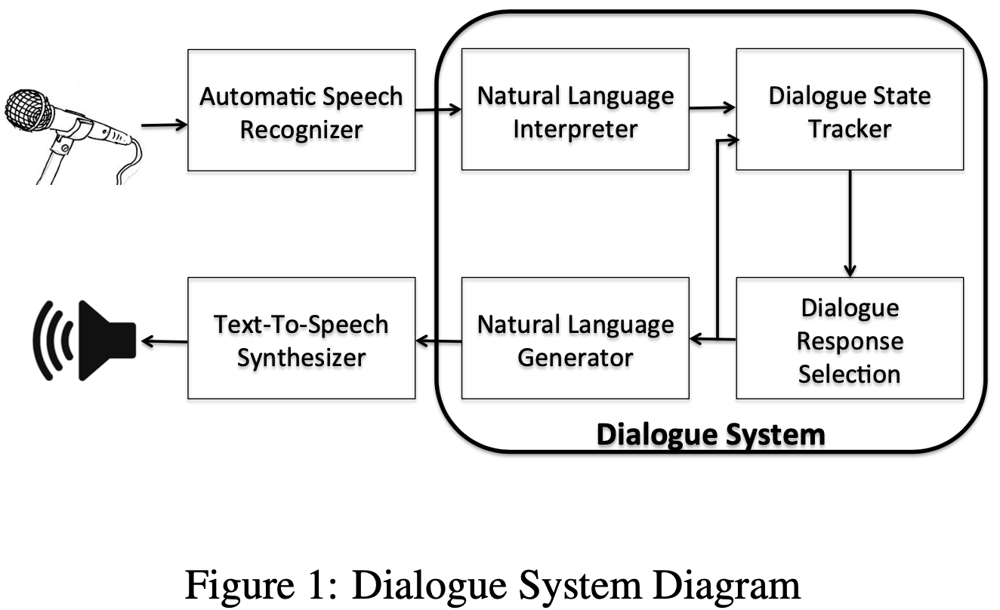
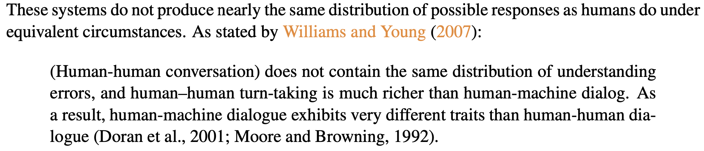

- toc
{:toc}


### 02/21

---

#### thesis related

1. Learn how to use `BERTScore`, and run an experiment on two corpus.

> ```bash
> # before call this function, all the text files should be detokenized!
> 
> bert-score -r example/refs.txt -c example/hyps.txt --lang en
> bert-score -r example/refs.txt -c example/hyps.txt --lang en --rescale_with_baseline
> 
> # multiple reference
> bert-score -r example/refs.txt example/refs2.txt -c example/hyps.txt --lang en
> ```

1. Download and preprocess `IWSLT17 EN-FR`, `WMT14 EN-DE` datasets, check where to download `WMT EN-ZH` datasets.
2. ~~Run `transformer` baseline on `IW` dataset.~~ `Use Yongwei's GPU machine, thanks Yongwei`

---

#### What are the related works to `LaMDA` and `Meena`?

> **[Done]**: mainly about evaluation (learnable metrics)

#### ~~How to learn (few-shot, zero-shot) task-oriented dialogue system?~~

> HelloGPT2
>
> Contrastive learning

#### ~~What benchmarks to use? The data form of each datasets?~~


### 02/22

---

#### thesis related

- Ask `Yongwei` for help: use his GPU machine and config. running environment and start run experiments on `WMT14 EN-DE`. **[Done]**

- Read the `fairseq-da` code, make sure the training output **clear** log. **[Unfinished]**

- Preprocess `WMT20 ZH-EN` file to get 1000,000 bitext pairs. **[Unfinished]**

---

#### What benchmarks to use?  What are their data formats?

> Read `MultiWoz`, `TicketTalk`, `Ubuntu dialogue`

- `MultiWoz`: Each dialogue is annotated with a sequence of dialogue states and corresponding system dialogue acts, hence, MultiWOZ can be used to develop individual system modules as separate classification tasks and serve as a benchmark for existing modular-based approaches.
  - Existing dialogue datasets can be divided into: machine-machine, human-machine, human-human

#### ~~What are the current experimental settings for few-shot TOD? What are the main techniques?~~

> Grasp some intuitions of this question by reading `TOD-BERT` and `SOLOIST`.

#### ~~What are the core problems in few-shot TOD?~~


#### Reading this [corpus survey](https://arxiv.org/abs/1512.05742) and extract corpora for TOD

This survey has **6** sections:

1. Intro

2. Characteristics of data-driven dialogue system: ***non-goal oriented, goal driven; component-based, end-to-end***.

   

3. Dialogue interaction types & aspects

   - Written, spoken, multi-modal

   - Human-human, human-machine

     

   - Corpus size

   - Naturalness

4. Available datasets

   - there are five tables [here](https://breakend.github.io/DialogDatasets/)

5. Discussion

6. Conclusion

> Section 4 provides categorisation of all kinds of dialogue corpora according to principles proposed in Section 2 and 3.
>
> **Practice**
>
> I learn how to download OpenTiitle corpus espectially for a single languange.


### 02/23

---

#### thesis related

- Read the `fairseq-da` code, to learn the training `options`, especially for **logging**.
- Prepare `WMT20 ZH-EN` 1,000,000 bitext.
- Prepare `IWSLT17 EN-FR` bitext.

---

#### Find and summarize benchmarks for TOD in recently years; record them in `overleaf`.

> Including recent multimodal TOD benchmarks.

#### What are the current experimental settings for few-shot TOD? What are the main techniques?

> `SOLOIST` and `TOD-BERT`

#### Summarize recent years' TOD works, summarize the trends into `Keynote`.

> EMNLP 2021
>
> ACL 2021
>
> NAACL 2021

- Reading surveys *[Recent Advances and Challenges in Task-oriented Dialog Systems](https://arxiv.org/pdf/2003.07490.pdf)*, Jun. 23 2020 and [A Survey on Dialogue Systems: Recent Advances and New Frontiers](https://www.kdd.org/exploration_files/19-2-Article3.pdf), `kdd` 2019.

---

