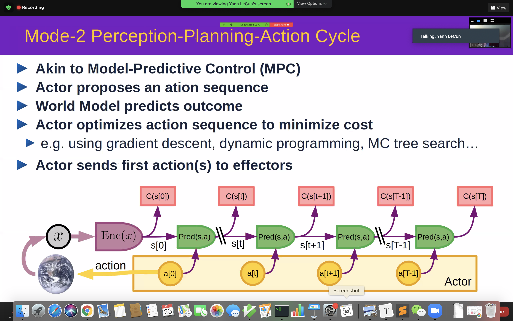
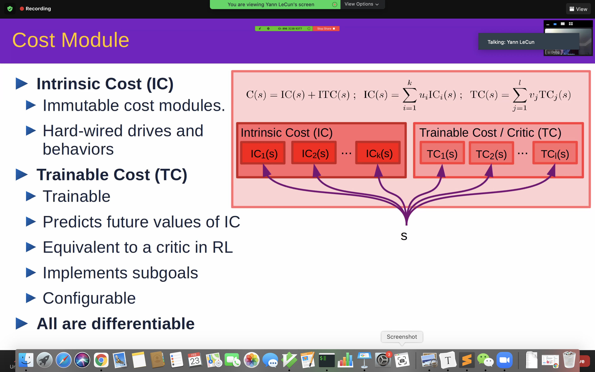
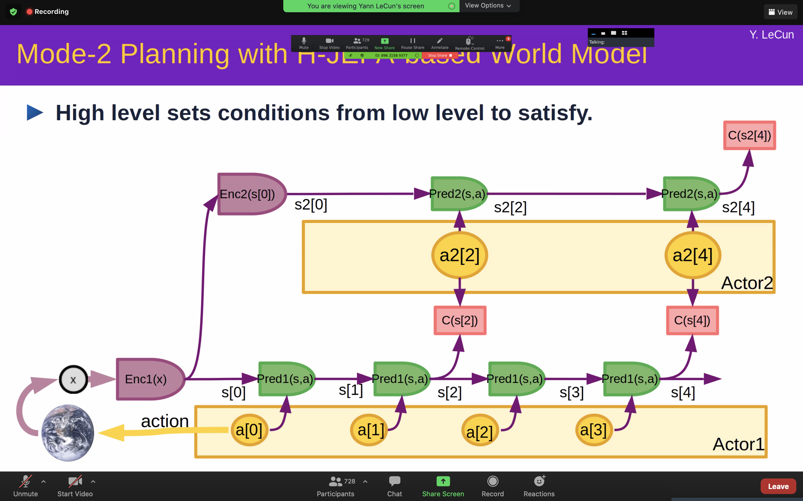
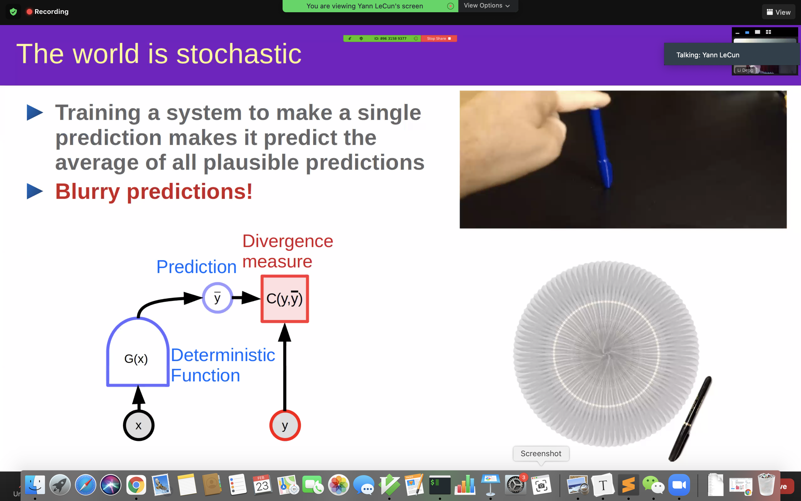
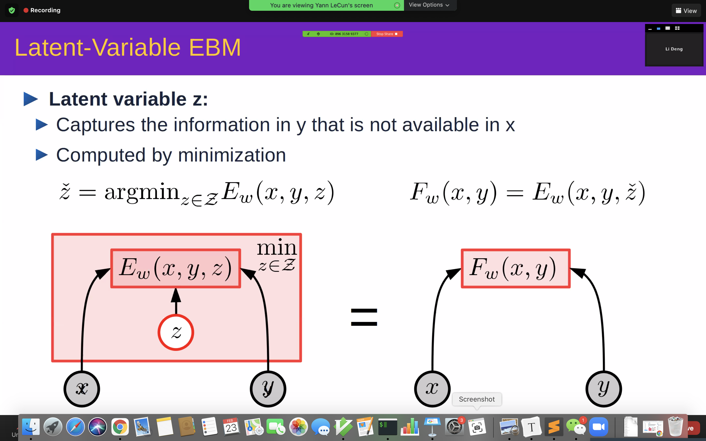
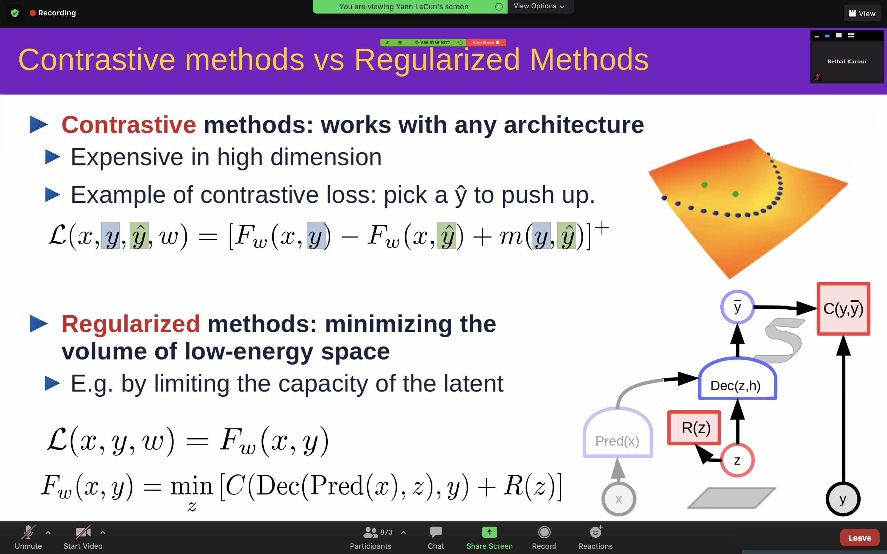
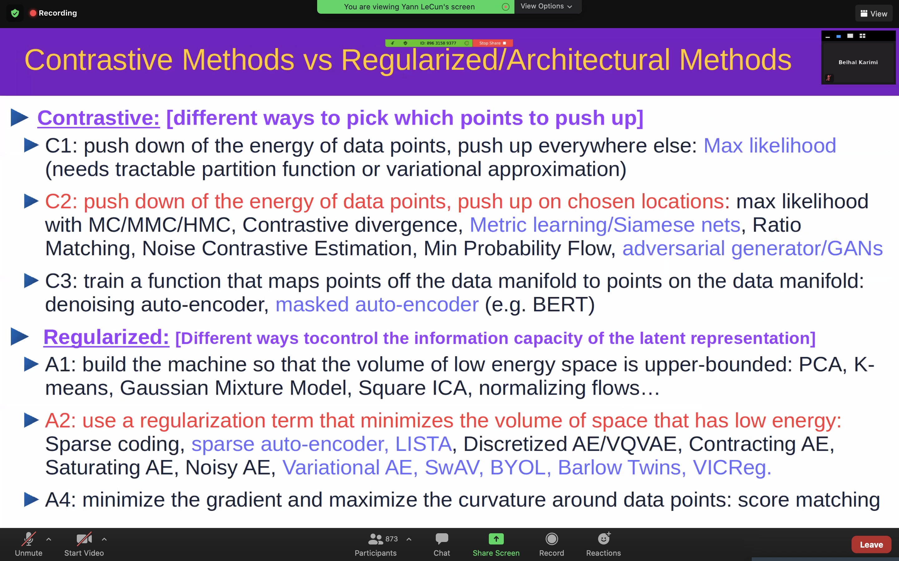

- toc
{:toc}

> **Disclaimer**. I haven't understand much about his blueprint of automomous AI, that is, the modular structure architecture and how it learns through optimal control (?) instead of reinforcement learning. So here I only summarize what I have gained intuition about, and might add a few more things after discussion with my friends.

### The whole architecture and the techniques to achieve (some of) them

- **Configurator**: configures other modules for task
- **Perception**: estimate *states* of the outside world
- **Word Model** [WM]: like the so-called *model* in model-based reinforcement learning
- **Cost**: computes *discomfort*
- **Actor**: finds optimal action sequences, or predict *actions*
- **Short-term memory**: stores state-cost episodes

| Module            | Technique                                                    | /    |
| ----------------- | ------------------------------------------------------------ | ---- |
| Configurator      | /                                                            |      |
| Perception        | /                                                            |      |
| World Model       | Self-supervised learning;                                    |      |
| Cost              | Refer to the slide below; Inverse reinforcement learning (?) |      |
| Actor             | Refer to the slide above                                     |      |
| Short-term memory | Hierarchical JEPA (?)                                        |      |

> **My two cents.**
>
> This architecture is very vague to me, since I could not simulate this architecture smoothly.
>
> For example, according to the `Model-2` slide above the table, the world model is used to carry out the `green` boxes, from $$s[0]$$ to $$s[T]$$, then we can use the cumulative cost across the $$T$$ time-steps (Intrinsic+Trainable Cost) to evaluate the action sequence. However, **what action the model take at current time-step?** Does the model sample several action sequences starting from $$\mathcal{A}[0] = \{ a_0^1, a_0^2, a_0^3, ... \}$$, and choose the best future cost action in $$\mathcal{A}[0]$$.
>
> Another question is how to train them? Are these modules trained separately or end-to-end with gradient-based optimization?

LeCun at the end of his talk also propose a hierarchical architecture of his autonomous AI model, see the following slide. He always mentions that the hirarchical structure can abstract away fine-grained low-level futures (pixels and noises) so the high-level actor module might be easier to make decisions.

> **My two cents.**
>
> I think this idea should not be his original one, since at least in reinforcement learning, I have heard about the word [hierarchical reinforcement learning](https://people.cs.umass.edu/~mahadeva/papers/hrl.pdf), where the high-level actions are called options.

### How to handle predictive uncertainty?

This question is intuitive to me due to the example LeCun gives in the following slide.

He names this kind prediction as **blurry predictions** and then he move to his solution, that is, by using an Energy-Based  Model (EBM), the blurry prediction problem can be naturally solved.

> **My two cents.**
>
> I think he gives a nice but really high-level reasoning about the advantage of EBM over generative probabilistic models. That is in generative modeling, the model should predict/generate the grounding point of the pen (in the picture in the slide) which actually takes many possible outcomes, so the learning and inference of the model might be very hard. However, with an EBM, the possible grounding points are not predicted but modelled as all possible outcomes with low energy scores. This to me is less a learning burden than that of a generative predictive model.
>
> However, my above statements might be biased and wrong. According to LeCun, his support points for EBM are as follows:
>
> - "Probabilistic models are intractable in continuous domain" (due to computing of posterior or any terms that involves integration)
> - "Generative model must predict every detail of the world"

### On EBM and EBM with latent variable

Then LeCun gives most of detailed introduction to EBM and EMB with latent variable. I think this is corresponding to probabilistic model and Variational AutoEncoder. He says something about the general usage of $$z$$, but I miss it. But according to the slide below, the $$\hat{z}$$ is estimated through minimizing engergy given a fixed pair of $$(x, y)$$, can we gain some intuition of this $$z$$ here?

> **My two cents.**
>
> - Does $$z$$ capture similarity or difference between $$x, y$$?
>
> - Can $$z$$ capture disentanglement factor between $$y$$?

#### How to learn JEPA?

The most familiar part of LeCun's talk is how to learn the energy model, since I recently have read about [DPR](https://arxiv.org/abs/2004.04906) where passage/query encoder are trained in a contrastive learning manner, which is a default way of training EBMs and other probabilistic models that are hard to normalize.

I think the above two slides are very informative and important. It shows two ways of training EMBs. I am quite familiar with the first contrastive framework but only starting to learn the second regularization framework.

LeCun think contrastive methods are doomed because of their high computational cost (in high dimensional space, **WHY?**). I think a doomed property of contrastive methods is the construction of negative examples. The quantity of negative examples must be large and the choice of negative examples are crucial to the learned feature representation.

### `TODO`

- Information-theoretic learning of JEPA
- VICReg `ICLR2022`

### Reference

[WM]. [World Models](https://worldmodels.github.io/).

[EBM]. [A Tutorial on Energy-Based Learning](http://yann.lecun.com/exdb/publis/pdf/lecun-06.pdf).

